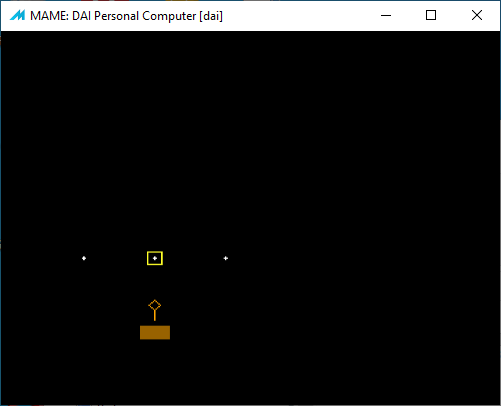

# DAI Software Development

[<< back](README.md)

## Library
Multisystem (DAI, CP/M) development library to build application

### libApp
Application abstraction library

### libText
Text I/O abstraction library

## MiniGraph
Simple Graphic Library to encode graphic sequences

```
Run	DoDraw(demo)

demo
	gc_SetColor($E)
	gc_SetOffset(100, 100)
	gc_call(drawBox)
	gc_SetColor($F)
	gc_call(drawPlus)
	gc_SetOffset(50, 100)
	gc_call(drawPlus)
	gc_MoveOffset(100, 0)
	gc_call(drawPlus)
	gc_SetColor($6)
	gc_SetOffset(100,40)
	gc_call(drawBar)
	gc_SetColor($A)
	gc_MoveOffset(0, 10)
	gc_call(drawShape)
	gc_END()
```

Demo Usage: _LOAD:RUN_


