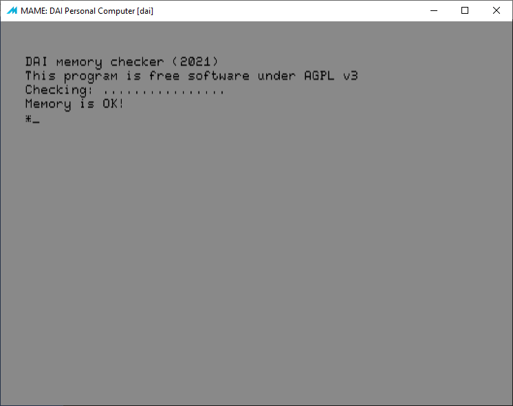
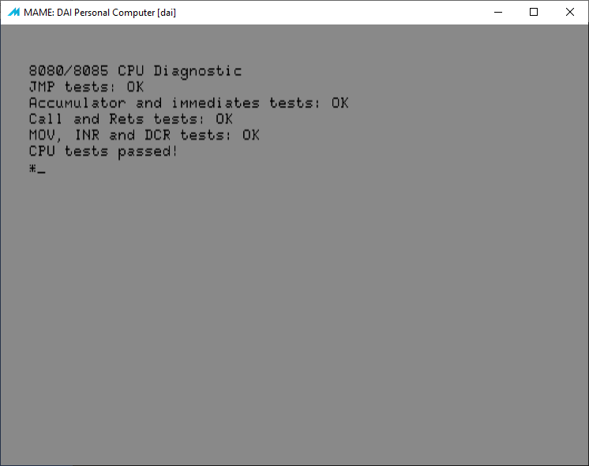
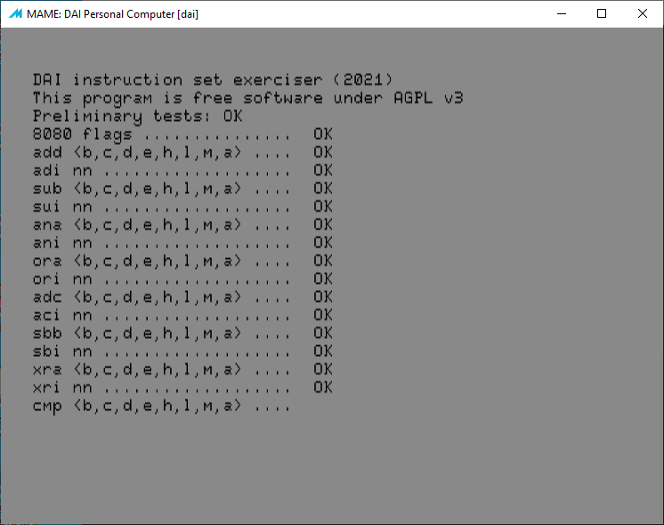
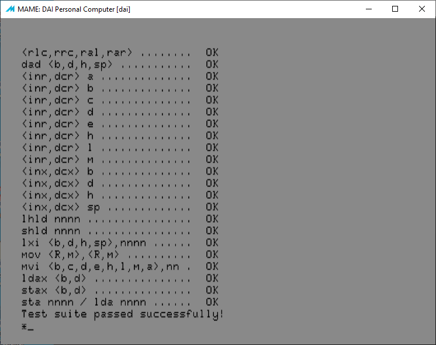

# Software Utilities

[<< back](README.md)

## TestMem
Check DAI memory.

Improved version of http://bruno.vivien.pagesperso-orange.fr/DAI/reparation/testmem.htm

## CPUdiag
Simple CPU diagnostic

## DAI instruction set exerciser
CPU diagnostic

